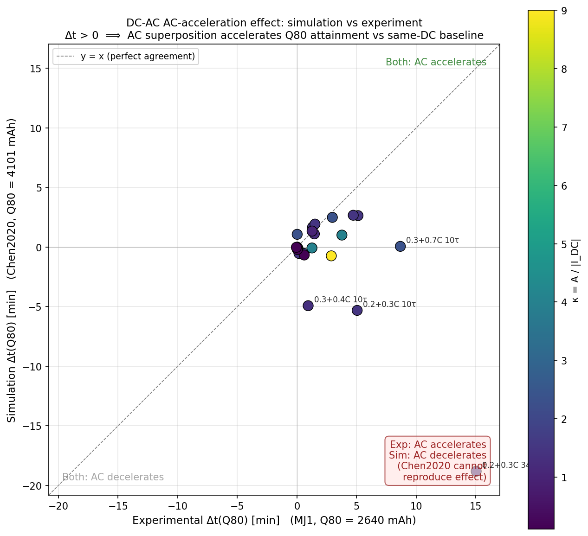

# DC-AC Superimposed Charging — PyBaMM Validation Framework

[](https://doi.org/10.5281/zenodo.19788879)
[](https://opensource.org/licenses/MIT)

> Physics-based simulation (PyBaMM SPMe + Chen2020 + lumped thermal) reproducing a DC-AC superimposed charging protocol for lithium-ion cells (LG INR18650 MJ1, 24 DC-AC + 6 DC baseline cases). Three-tier sim-vs-exp validation under strict-net charge accounting.

**Status**: v0.1 complete · 30/30 cases simulated · 9 commits · Zenodo DOI: [10.5281/zenodo.19788879](https://doi.org/10.5281/zenodo.19788879)

---

## TL;DR

A 30-case batch sweep validates a DC-AC superimposed charging protocol against experimental data on LG INR18650 MJ1 cells. Three independent error channels are isolated:

- ✅ **Thermal**: systematic offset (mean ΔT_max = −1.9 °C, 93% within ±3 °C) — Chen2020 thermal model captures qualitative behavior
- ✅ **CC kinetics**: multiplicative offset (sim/exp ≈ 1.07, range [0.99, 1.17]) — Chen2020 ~7% slower than MJ1
- ❌ **AC kinetics**: categorical mismatch (sign agreement 48%) — under MJ1-aligned frequencies, simulation does not reproduce the AC-acceleration direction observed experimentally

The third finding is documented as a **bounded conclusion** (see [Caveat](#caveat-frequency-reference) below).

---

## Core finding



The figure compares simulated vs experimental time-savings at 80% state-of-charge: Δt(Q80) > 0 means AC superposition accelerates Q80 attainment relative to the same-DC-rate baseline. Of 23 successfully-simulated DC-AC cases, only 11 (48%) show sign agreement between simulation and experiment. The simulation systematically predicts the wrong direction of AC effect on Q-progression.

This is *not* a quantitative offset (which is observed in T_max and CC time) but a *qualitative* mismatch — the central scientific result of this validation.

---

## Validation results

| Quantity | sim vs exp pattern | Statistics | Interpretation |
|---|---|---|---|
| **T_max** (29 cases) | systematic offset | mean ΔT = −1.90 °C, std = 0.84 °C, 93% within ±3 °C | Chen2020 thermal model OK; offset attributable to PT100 surface vs cell-volume-averaged measurement convention plus heat-transfer coefficient calibration |
| **CC time** (23 DC-AC) | multiplicative offset | mean ΔCC = +13.1 min, sim/exp ≈ 1.07 | Chen2020 charge kinetics slower than MJ1, systematic |
| **Δt(Q80)** (23 DC-AC) | **categorical mismatch** | sign agreement 11/23 (48%); mean exp = +2.50 min, mean sim = −0.70 min | Under MJ1-aligned frequency grid, SPMe + Chen2020 does not reproduce AC acceleration direction |

**Excluded**: 1 DC-AC case (`0.2+0.8C 10τ`) hits Min V event in Chen2020 simulation — no equivalent in MJ1 experiment.

### Caveat: frequency reference

All simulations use experimentally-derived frequency labels (1τ = 0.0143 Hz, 10τ = 0.00143 Hz, etc.), where **τ = 11.1 s** comes from MJ1 HPPC extraction (SOC=20%, charging direction, 3-test median). Applied to Chen2020 (LG M50 — different chemistry and geometry), these frequencies do not align with Chen2020's intrinsic electrochemical time scale. The observed sign reversal therefore conflates two hypotheses:

1. **Cell-physics hypothesis**: SPMe + Chen2020 genuinely lacks the AC-acceleration mechanism
2. **Frequency-mismatch hypothesis**: Chen2020 may exhibit AC acceleration at its own intrinsic frequency band — outside the MJ1-aligned grid sampled here

These are not separable from the v0.1 data alone.

---

## Reproducibility

**Tested on**: macOS Apple Silicon, Python 3.12.13, PyBaMM 26.3.1.

```bash
git clone https://github.com/jiaxingLu/pybamm-dcac-superimposed.git
cd pybamm-dcac-superimposed
python3.12 -m venv .venv
source .venv/bin/activate
pip install -r requirements.txt

# Re-run the 30-case batch (~25 seconds wall-clock)
jupyter lab notebooks/05_batch_scan.ipynb

# Re-generate validation figures
jupyter lab notebooks/06_validation_figures.ipynb
```

The 30-case results JSON (~10 MB) is gitignored; regenerate by running notebook 05.

---

## Repository structure
```
.
├── notebooks/
│   ├── 01_hello_pybamm.ipynb           # Environment validation, 1C discharge baseline
│   ├── 02_dcac_first_injection.ipynb   # First DC-AC waveform via Interpolant
│   ├── 03_dc_baseline_0.9C.ipynb       # End-to-end 5-phase protocol (DC baseline)
│   ├── 04_dcac_single_case.ipynb       # Representative case 0.3C+0.7C @ 10τ
│   ├── 05_batch_scan.ipynb             # 30-case sweep + run_single_case() function
│   └── 06_validation_figures.ipynb     # Δt(Q*), T_max, CC time validation
├── figures/                             # 6 figures (Days 4-5 + Day 7)
├── data/
│   ├── figure1_master_table_cleaned.csv  # Experimental ground truth (30 cases)
│   └── results_day6_summary.csv          # Sim summary (full results JSON gitignored)
├── scripts/
│   └── add_cc_cv_columns.py              # Reproducible CSV augmentation
├── ROADMAP.md
├── requirements.txt
└── README.md
```


---

## Methodology snapshot

**Cell model**: SPMe (single particle with electrolyte) + lumped thermal, Chen2020 parameter set (LG M50, 5.0 Ah).

**Protocol** (5 steps in single `pybamm.Experiment`):

1. Phase 0a: 1C discharge to 2.5 V
2. Phase 0b: CV hold at 2.5 V until C/136
3. Phase 1: rest 3805 s
4. Phase 2: DC-AC charge `I(t) = I_DC + A·sin(2π·f·t)` until V = 4.2 V (via `pybamm.step.CustomStepExplicit`)
5. Phase 3: CV hold at 4.2 V until C/68

**Strict-net charge accounting** (six locked constraints):

1. Signed integration: `Q_net(t) = -∫I dt` (no rectification)
2. Non-monotonic Q(t) preserved (AC reversal causes local decreases)
3. First-passage only (no interpolated averages)
4. Unified Q-grid across cases (each battery uses own capacity)
5. No signal modification, no AC smoothing
6. Δt(Q) is a curve, not a scalar

**Sign convention**: PyBaMM standard, +I = discharge, −I = charge.

**Capacity normalization**: Q-grid Q40/Q60/Q80 referenced to each battery's own observed capacity ceiling (sim 5126 mAh, exp 3300 mAh).

---

## v0.1 status (this release)

- [x] PyBaMM 26.3.1 environment validated
- [x] Chen2020 baseline (1C discharge)
- [x] DC-AC current injection via `CustomStepExplicit`
- [x] 5-phase protocol pipeline
- [x] DC-AC single case end-to-end (0.3C+0.7C @ 10τ)
- [x] 30-case batch sweep (24 DC-AC + 6 DC baseline)
- [x] Three-tier sim-vs-exp validation figures

## Future work

This v0.1 release establishes the simulation pipeline and identifies the AC-kinetic mismatch under MJ1-aligned frequencies. Several extensions to the validation framework are under active development. Updates will be released as commits to this repository.

---

## Citation

If you use this code or methodology, please cite via Zenodo DOI:

```bibtex
@software{lu_2026_pybamm_dcac,
  author       = {Lu, Jiaxing},
  title        = {{DC-AC Superimposed Charging Validation: 
                   PyBaMM-based sim-vs-exp framework}},
  month        = apr,
  year         = 2026,
  publisher    = {Zenodo},
  version      = {v0.1.0},
  doi          = {10.5281/zenodo.19788879},
  url          = {https://doi.org/10.5281/zenodo.19788879}
}
```

The corresponding experimental manuscript (in preparation) will be added here upon publication.

---

## Author

**Jiaxing Lu** — M.Sc. Electrical Engineering, Hochschule Mittweida  
Specialization: lithium-ion battery characterization and modeling

- GitHub: [@jiaxingLu](https://github.com/jiaxingLu)
- ORCID: [0009-0009-6311-6688](https://orcid.org/0009-0009-6311-6688)
- LinkedIn: [jiaxinglu](https://www.linkedin.com/in/jiaxinglu/)

## License

MIT
